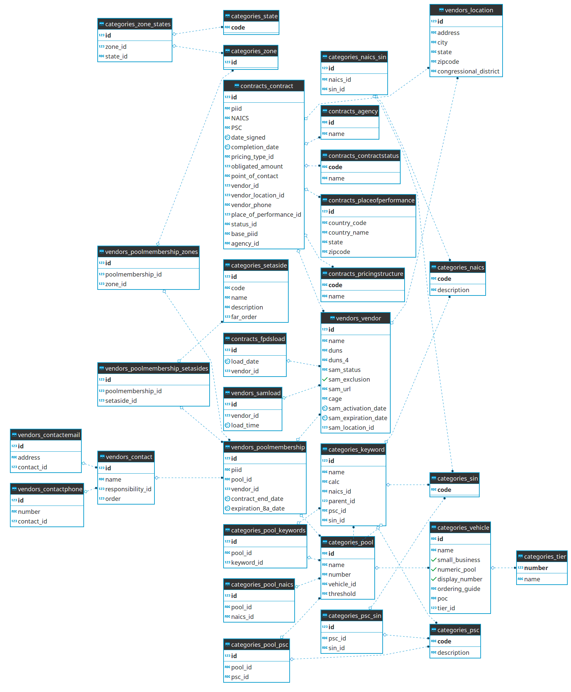

# Discovery data

**<** [System and Interface Design](design.md) | **^** **[Architecture Overview](readme.md)** | [Static Assets](assets.md) **>**

 

## Overview

The Discovery application system pulls in all available data from external API's.  These API's help us stay up to date with events happening in the federal contracting space related to vehicles that are followed by Discovery.  The updates occur on a periodic basis, at least once a day.

Currently the OASIS and OASIS Small Business vehicles are supported but there are plans to add more vehicles in the near future.

Below is a diagram representing the flow of information for the Discovery system from the various API's we fetch data from.

As you can see an internal worker server constantly polls for tasks, the updates data from the appropriate API, and writes that data to the PostgreSQL database, as well as the task results for audit purposes.

 

## Classification information

The basic information that holds everything together in the system is classification information.  This data is currently stored as fixtures in the application source code, and are updated with releases of the Discovery application.

The **manage.py load_categories** command is executed on every deployment of the Discovery scheduler.

There is a Celery task wrapper for this command in case it ever pulls data from a remote API on a periodic basis, but it also comes in handy for testing the scheduler and worker processes ocassionally, due to it's speed of execution.

 

##### NAICS codes

NAICS codes are the foundation of how vendors and contracts are categorized in the Discovery system.

You can find a list of all the available NAICS codes in the [NAICS fixture data](https://github.com/PSHCDevOps/discovery/blob/master/vendors/fixtures/naics.json).

 

##### Vendor setaside categories

Certain small businesses have certain regulated advantageds over others in the proceurement process.  These are known as setasides or classifications that a business may have, such as veteran owned, minority owned, 8a, HUBZone, etc...

You can find a list of all the available setasides in the [setaside fixture data](https://github.com/PSHCDevOps/discovery/blob/master/vendors/fixtures/setasides.json).

 

##### Vendor pools

The Discovery application maintains pools of vendors for each vehicle.  Each pool is then used to classify vendors in the system in filtered queries.

You can find a list of all the available vendor pools in the [vendor pool fixture data](https://github.com/PSHCDevOps/discovery/blob/master/vendors/fixtures/pools.json).

 

## Vendor information

Vendors make up the core data type in the Discovery system.  All related data displays are grouped around vendors currently.  Vendor information is provided both through CSV file information provided by GSA PSHC staff in the **vendors/docs** directory and through SAM API registration data that is returned for the DUNS number of the vendor in the SAM system.

You can find examples of vendor data elements in the [vendor fixture data](https://github.com/PSHCDevOps/discovery/blob/master/vendors/fixtures/vendors.json).

 

##### Pool membership

Each vendor is classified into different pools using a PIID value which serves as a unique identifier for the vendor.

You can find examples of vendor PIID mapping data elements in the [vendor PIID fixture data](https://github.com/PSHCDevOps/discovery/blob/master/vendors/fixtures/poolpiids.json).

 

##### SAM registrations

We collect vendor information from the [SAM API](https://gsa.github.io/sam_api/sam/).  This service provides information such as status, location, CAGE code, setasides granted, etc...

See the **vendors/management/commands/load_sam.py** command for more detailed information.

 

##### Capability statements

Any Vendor Capability Statements that are added to [this folder](https://github.com/PSHCDevOps/discovery/tree/master/discovery_site/static/discovery_site/capability_statements) will automatically be linked to on the vendor's page. The file must be a PDF, and its name must be only the vendor's DUNS number.

There will be more work on tighter integration of vendor capability statements in future Discovery application development.

 

## Contract information

The Discovery application collects information on contracts in order to generate information for vendors in the followed acquisition vehicle vendor pools.  The Discovery application looks primarily at contract awards and modifications, which amend contract information in our system as they occur.

You can find examples of contract data elements in the [contract fixture data](https://github.com/PSHCDevOps/discovery/blob/master/contract/fixtures/contracts.json).

 

##### FPDS records

We collect contract information from the [FPDS ATOM Feeds](https://www.fpds.gov/wiki/index.php/ATOM_Feed_FAQ).  This service provides all of our contract data, of which we use contract dates, amounts, contact information, revenue and employee figures, and agency information.

See the **contract/management/commands/load_fpds.py** command for more detailed information.

 

## Scheduling updates and monitoring progress

See the scheduling section in the [Discovery setup documentation](../start/setup.md) for more information on how to schedule data updates in the Discovery system through the administrative interface.

 

## A look at how Discovery data fits together

 
